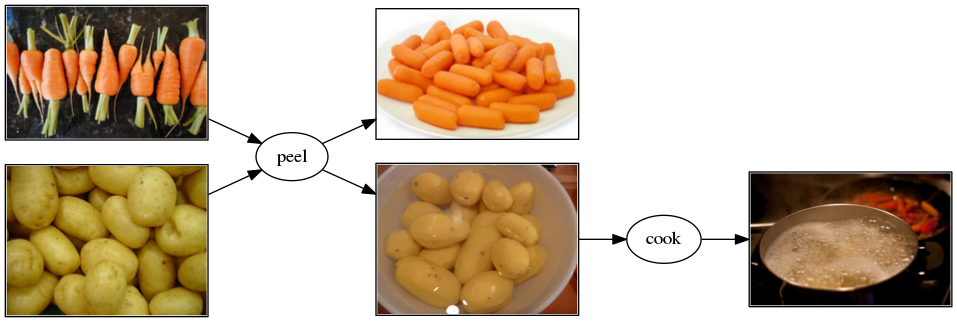
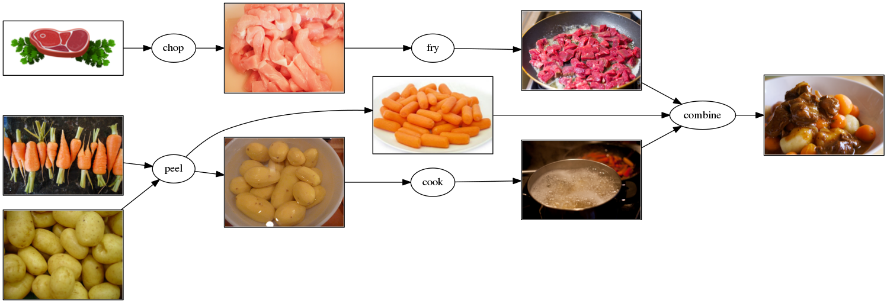

# How to prepare vegetables?

1. Start an R session in this directory (`03-vegetables`)
    - RStudio users, open the `*.Rproj` file in this directory
1. Build the project:
    ```r
    remake::make()
    ```
1. Fetch the ragout:
    ```r
    remake::fetch("ragout")
    ```
1. Add rules to peel carrots, and to peel and cook potatoes:
    
    
    
    - Use the call `peel("raw_carrots.csv")` to peel carrots
    - Use the call `cook(peeled_potatoes)` to cook the peeled potatoes
    - Consult `?cooking::cooking` for further documentation

1. Build the project. Why are the vegetables not prepared?
1. Modify the rule to prepare the `ragout` to add `peeled_carrots` and `cooked_potatoes`
    
    
    
    - Call `combine(fried_meat, peeled_carrots, cooked_potatoes)` for the ragout

1. Build the project. Look at the final ragout with `remake::fetch("ragout")`
